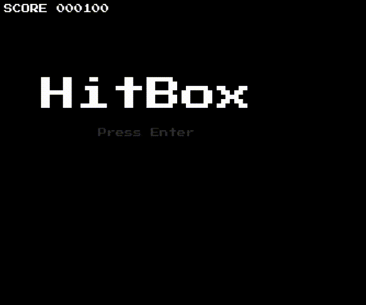

# HitBox

HitBox is a fast-paced, minimalist 2D physics betting game built entirely with **Python and Pygame**.  
Everything outside the background music (not included here) was implemented from scratch—collision detection, health bars, particle effects, UI, screen shake, pause menus, smooth animations, and an unpredictable pickup system.  

This project was created as a way to **teach myself Python** while building something interactive and visually engaging. It demonstrates clean code structure, modular design, and strong problem-solving skills applied to game development.

---

## 💼 Why Recruiters Should Care

- Demonstrates **object-oriented programming** through well-structured game entities (`Fighter`, `Particle`, `DamageText`, `Pickup`).  
- Shows ability to build **complete interactive systems from scratch** (no engines/frameworks beyond Pygame).  
- Highlights **problem-solving** (collision detection, smooth health animations, screen effects, physics simulation).  
- Proves capacity to **self-learn** and **deliver polished results** using only core tools.  
- Code is **modular, readable, and production-quality**, reflecting strong software engineering practices.  
- Features **advanced visual effects** like particle systems with physics, screen shake, and dynamic trails.

---

## 🎮 Core Features

### **Raw Python + Pygame Implementation**
- **No external game engines or frameworks** - built from the ground up
- Custom physics simulation with realistic bouncing and collision detection

### **Advanced Fighter System**
- **Dynamic movement** with arena boundary collision and bouncing
- **Health management** with smooth health bar animations that decay naturally  
- **Damage handling** with flashing "hurt" feedback and invincibility frames
- **Visual trails** that follow fighters during movement
- **Mario-style invincibility** with rainbow color cycling effects

### **Enhanced Particle Engine**
- **Multi-type particles**: sparks, explosions, trails with unique physics properties
- **Arena physics**: particles bounce off walls with energy loss and gravity effects
- **Dynamic effects**: collision sparks, damage indicators, pickup glows
- **Wind simulation** for subtle environmental particle movement

### **Pickup System (Adds Strategic Unpredictability)**
- **Health pickups**: Restore fighter health with green cross visual design
- **Invincibility pickups**: Grant temporary invincibility with rainbow cycling effects  
- **Smart spawning**: Limited active pickups with cooldown timers
- **Visual feedback**: Expanding ring effects and particle glows on collection
- **Collision detection**: Multiple fighters can compete for the same pickup

### **Betting & Scoring System**
- **Interactive character selection**: Click or use keyboard to choose your fighter
- **Score tracking**: Points gained/lost based on betting accuracy  
- **High score persistence**: Track your best performance across sessions
- **Risk/reward**: Lose all points and restart, or keep building your score

### **Professional UI & Visual Polish**
- **Retro-style fonts** with authentic pixel-perfect rendering
- **Screen shake effects** with dynamic intensity based on collision force  
- **Smooth transitions** with checkerboard wipe effects between game states
- **Floating damage text** with physics-based movement and fade animations
- **Live background blur** for pause menus
- **Health bar animations** that smoothly decay to show recent vs. current damage

### **Sound System Architecture** 
- **Modular sound manager** ready for audio implementation
- **Event-driven audio triggers** for collisions, pickups, menu navigation
- **Volume control** and sound toggle functionality built-in

---

## 📷 Gameplay


 

> 📌 A short **GIF** showing collisions, particles, and screen shake in my game.

---

## 📂 Project Structure

```
HitBox/
├── main.py        # Game loop, states, UI, scoring system, transitions
├── fighter.py     # Fighter class (movement, health, effects, trails)
├── particles.py   # Particle system (physics, collisions, visual effects)
├── assets/
│   ├── fonts/
│   │   └── PressStart2P.ttf    # Retro pixel font
│   └── screenshots/            # Gameplay images and GIFs
└── README.md      # This file
```

---

## 🚀 Installation & Setup

1. **Clone the repository:**
   ```bash
   git clone https://github.com/yourusername/hitbox.git
   cd hitbox
   ```

2. **Install dependencies** (Python 3.8+ recommended):
   ```bash
   pip install pygame
   ```

3. **Run the game:**
   ```bash
   python main.py
   ```

---

## 🕹️ Controls

### **Menu Navigation**
- **Enter/Space** → Confirm selection, start game
- **Arrow Keys / WASD** → Navigate menus  
- **Mouse** → Click to select fighter in character selection
- **Escape** → Go back, pause game

### **Gameplay**
- **Enter/Escape** → Pause game
- **Fighters move automatically** → Watch the physics-based combat unfold
- **Strategic betting** → Choose wisely to build your score!

---

## 🔧 Technologies Used

- **Python 3** → Core programming language
- **Pygame** → Graphics rendering, input handling, sound system foundation
- **Object-Oriented Design** → Clean, modular class architecture  
- **Physics Simulation** → Custom collision detection and particle physics
- **State Management** → Multiple game states with smooth transitions

---

## 🎯 Technical Highlights

### **Custom Physics Engine**
- Realistic collision detection with momentum transfer
- Particle physics with gravity, air resistance, and bouncing
- Arena boundary constraints with energy conservation

### **Advanced Visual Effects** 
- Multi-layered particle system with different behavior types
- Dynamic screen shake with intensity scaling  
- Smooth health bar animations with display/actual value separation
- Real-time background blur effects for UI overlays

### **Game Architecture**
- Clean separation of concerns across multiple modules
- Event-driven state management system
- Modular pickup system that's easily extensible
- Comprehensive UI system with multiple game states

### **Performance Optimizations**
- Efficient particle lifecycle management  
- Smart rendering with offset-based screen shake
- Optimized collision detection using pygame Rect operations

---

## 📖 Learning Outcomes

This project demonstrates several key programming competencies:

- **Object-Oriented Programming**: Well-structured classes with clear responsibilities
- **Game Development Fundamentals**: Update loops, rendering pipelines, state management
- **Physics Simulation**: Collision detection, momentum, gravity, and particle dynamics  
- **UI/UX Design**: Intuitive controls, visual feedback, and polished user experience
- **Code Organization**: Modular design that's maintainable and extensible
- **Problem Solving**: Complex systems like particle physics and smooth animations built from scratch

This project highlights my ability to **learn independently**, **design complex systems**, and **write production-ready Python code** while creating an engaging, polished user experience.

---

## 🚀 Future Improvements

- **Audio Integration**: Sound effects and background music using the built-in sound manager
- **AI Fighters**: Computer-controlled opponents with different fighting styles  
- **Power-up Variety**: Speed boosts, size changes, damage multipliers
- **Tournament Mode**: Multi-round competitions with bracket systems
- **Online Multiplayer**: Real-time battles between remote players
- **Custom Arenas**: Different battlegrounds with unique physics properties
- **Replay System**: Record and review epic battles
- **Mobile Support**: Touch controls and responsive design

---

## 🤝 Contributors

Built by **Etam Tamo Wonkam** as a self-directed Python learning project.

---

## 📜 License

MIT License – free to use and modify.

---

⚡ **Ready to see the code in action?** Clone the repo and experience the satisfying particle effects, screen shake, and unpredictable pickup-powered battles yourself!
